---
author:
  - name: Лассине Сако
    email: 1032255150@pfur.ru
    affiliation:
      - name: Российский университет дружбы народов
        city: Москва
        country: Российская Федерация

title: "Лабораторная работа № 2"
subtitle: "Управление версиями. Git и GitHub"
date: today
date-format: "YYYY-MM-DD"
lang: ru
license: "CC BY"
---

# Лабораторная работа №2

## Студент

- **Лассине Сако**
- Российский университет дружбы народов
- Факультет физико-математических и естественных наук
- Направление: Прикладная информатика

# Цель работы

## Цель

Изучить систему контроля версий Git и платформу GitHub, освоить настройку Git, создание SSH- и GPG-ключей, использование GitHub CLI и работу с удалёнными репозиториями.

# Основные задачи

## Выполненные действия

- Установка Git и GitHub CLI
- Настройка Git
- Создание SSH-ключей
- Создание GPG-ключей
- Настройка GitHub CLI
- Создание репозитория курса
- Выполнение подписанных коммитов

# Настройка Git

## Первые этапы

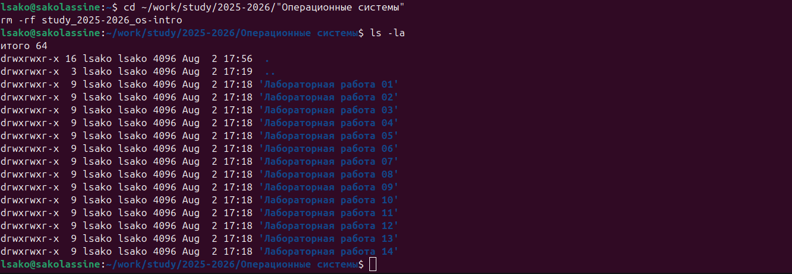{width=80%}

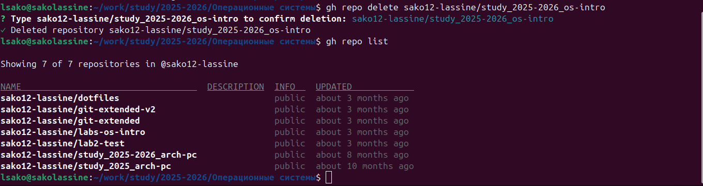{width=80%}

# Настройка безопасности

## SSH и GPG

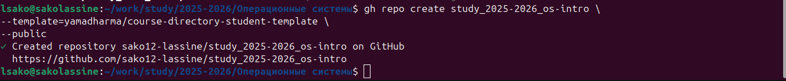{width=48%}
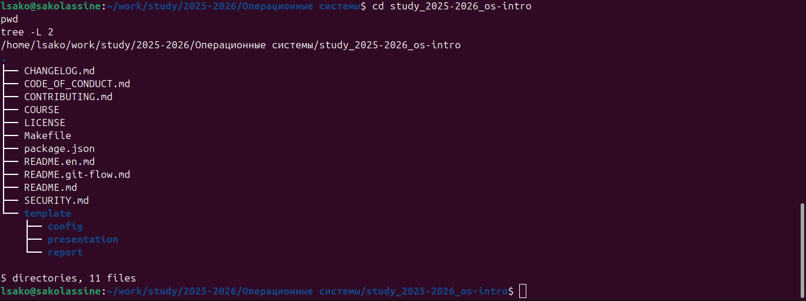{width=48%}

# GitHub

## Работа с GitHub

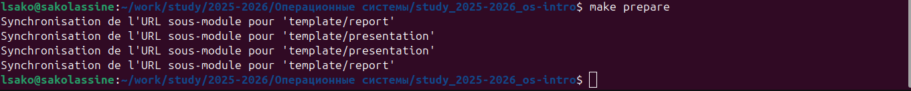{width=80%}

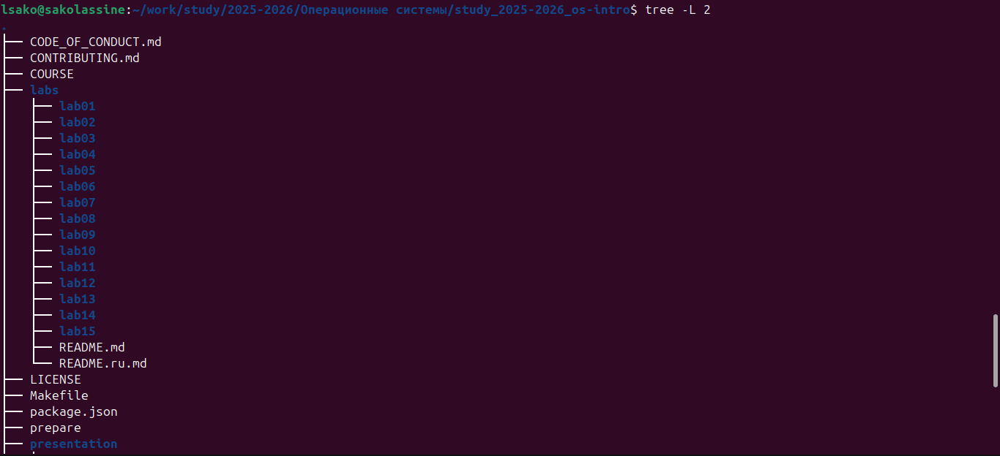{width=80%}

# Подготовка проекта

## Структура проекта

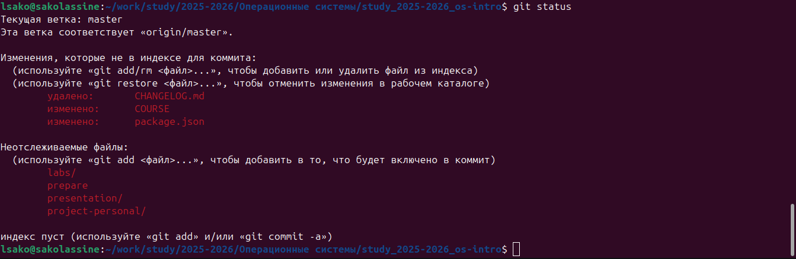{width=80%}

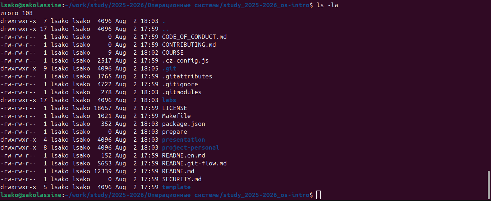{width=80%}

# Работа с Git

## Коммиты и публикация

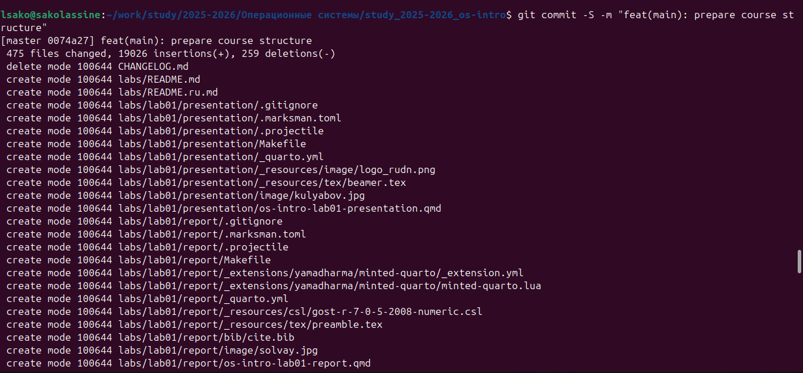{width=80%}

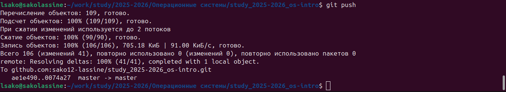{width=80%}

# Проверка подписи

## GPG

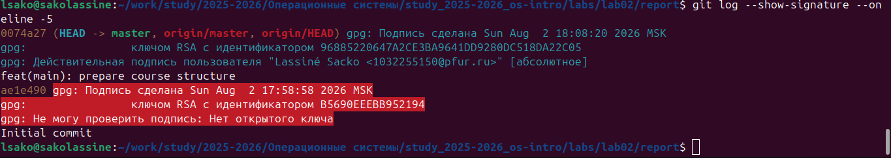{width=80%}

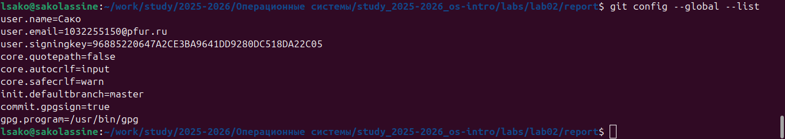{width=80%}

# Выводы

## Итоги

- Изучена система Git.
- Освоена работа с GitHub.
- Настроены SSH и GPG.
- Выполнены подписанные коммиты.
- Создан и опубликован репозиторий курса.
- Получены практические навыки работы с системой контроля версий.

# Спасибо за внимание

## Вопросы?

Спасибо за внимание!
