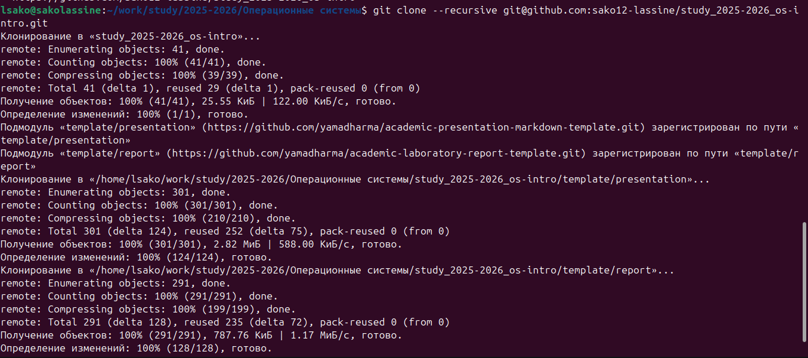
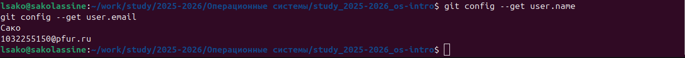
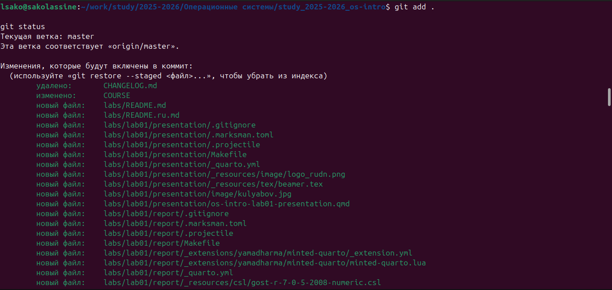
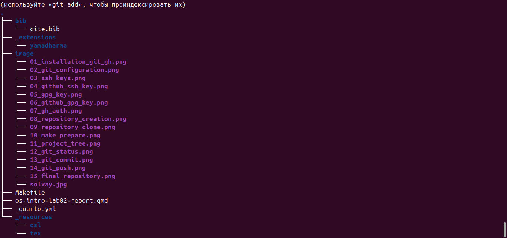
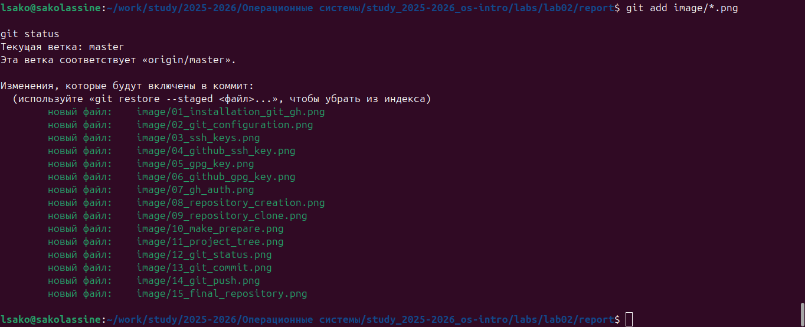
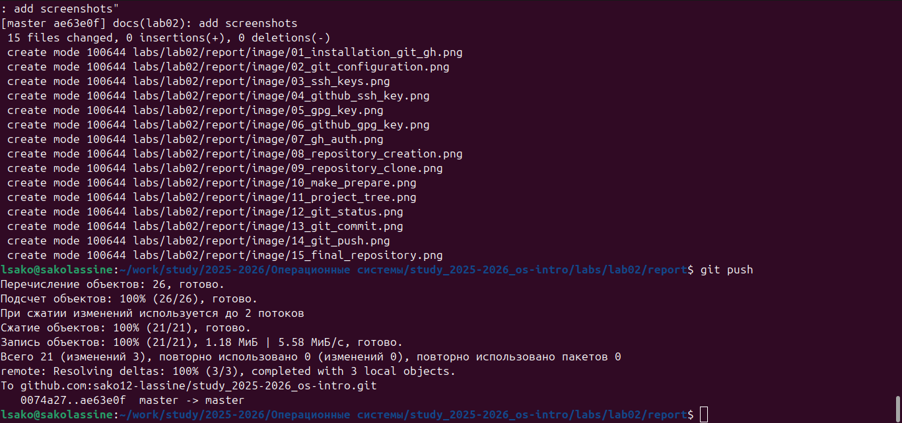

---
author:
  - name: Лассине Сако
    email: 1032255150@pfur.ru
    affiliation:
      - name: Российский университет дружбы народов
        city: Москва
        country: Российская Федерация

title: "Лабораторная работа № 2"
subtitle: "Управление версиями. Git и GitHub"
lang: ru
license: "CC BY"
---

# Цель работы

Изучить систему контроля версий Git и платформу GitHub, освоить настройку Git, создание SSH- и GPG-ключей, настройку GitHub CLI, создание репозитория курса, подготовку структуры проекта и выполнение подписанных коммитов.

# Задание

В ходе лабораторной работы необходимо было:

- установить Git и GitHub CLI;
- выполнить настройку Git;
- создать SSH-ключ;
- создать GPG-ключ;
- добавить SSH- и GPG-ключи в GitHub;
- настроить автоматическую подпись коммитов;
- выполнить авторизацию через GitHub CLI;
- создать репозиторий курса на основе шаблона;
- подготовить структуру проекта;
- выполнить подписанный коммит;
- отправить результаты работы в удалённый репозиторий GitHub.

# Теоретическое введение

Git представляет собой распределённую систему контроля версий (Version Control System, VCS), предназначенную для хранения истории изменений файлов, организации совместной разработки программного обеспечения и управления различными версиями проекта.

Основными объектами Git являются репозиторий (repository), рабочая копия (working copy), коммит (commit) и история изменений (history). Репозиторий содержит все версии проекта, рабочая копия используется для редактирования файлов, коммит фиксирует состояние проекта в определённый момент времени, а история позволяет просматривать последовательность всех изменений.

Git относится к распределённым системам контроля версий. Каждый разработчик имеет полную локальную копию репозитория, что позволяет выполнять большинство операций без подключения к сети. Для совместной работы обычно используется удалённый репозиторий, размещённый на GitHub.

Для безопасной аутентификации используется протокол SSH, а для проверки авторства изменений применяется цифровая подпись GPG. Подписанные коммиты подтверждают, что изменения были выполнены владельцем соответствующего криптографического ключа.

GitHub предоставляет удобные средства хранения проектов, совместной разработки, управления версиями, просмотра истории изменений и автоматизации процессов разработки.

# Выполнение лабораторной работы

## Установка и настройка Git

В начале лабораторной работы были установлены необходимые инструменты для работы с Git и GitHub. После установки была проверена их работоспособность.

{#fig-001 width=90%}

Далее были настроены имя пользователя и адрес электронной почты для Git.

{#fig-002 width=90%}

## Создание SSH-ключа

Для безопасной аутентификации с GitHub была создана пара SSH-ключей.

{#fig-003 width=90%}

После этого открытый SSH-ключ был добавлен в аккаунт GitHub.

{#fig-004 width=90%}

## Создание GPG-ключа

Для подписи коммитов был создан GPG-ключ.

{#fig-005 width=90%}

После генерации открытый ключ был добавлен в настройки GitHub.

{#fig-006 width=90%}

## Авторизация GitHub CLI

Затем была выполнена авторизация с помощью GitHub CLI.

{#fig-007 width=90%}

## Создание репозитория

После успешной авторизации был создан репозиторий курса.

{#fig-008 width=90%}

Далее репозиторий был клонирован на локальный компьютер.

{#fig-009 width=90%}

## Подготовка структуры проекта

Структура проекта была автоматически создана командой `make prepare`.

{#fig-010 width=90%}

После подготовки была проверена структура каталогов проекта.

{#fig-011 width=90%}

## Проверка состояния репозитория

После подготовки структуры проекта было проверено текущее состояние репозитория.

{#fig-012 width=90%}

## Создание подписанного коммита

Все изменения были добавлены в индекс Git, после чего был создан подписанный GPG-коммит.

{#fig-013 width=90%}

## Отправка изменений на GitHub

После создания коммита изменения были успешно отправлены в удалённый репозиторий GitHub.

{#fig-014 width=90%}

## Проверка удалённого репозитория

После отправки была выполнена проверка содержимого удалённого репозитория.

{#fig-015 width=90%}

## Проверка цифровой подписи

Для подтверждения корректной настройки GPG была выполнена проверка истории коммитов с отображением цифровой подписи.

{#fig-016 width=90%}

## Проверка глобальной конфигурации Git

Далее была проверена глобальная конфигурация Git.

{#fig-017 width=90%}

## Проверка состояния после добавления файлов

После добавления файлов была повторно проверена рабочая область репозитория.

{#fig-018 width=90%}

## Коммит изображений

Все изображения лабораторной работы были добавлены в репозиторий и сохранены в отдельном подписанном коммите.

{#fig-019 width=90%}

## Финальная отправка изменений

После завершения лабораторной работы была выполнена финальная отправка изменений на GitHub.

{#fig-020 width=90%}

# Контрольные вопросы

## 1. Что такое системы контроля версий (VCS)?

Система контроля версий (Version Control System, VCS) — это программное обеспечение, предназначенное для хранения истории изменений файлов, совместной разработки проектов и восстановления предыдущих версий.

## 2. Что означают понятия repository, commit, history и working copy?

- **Repository (репозиторий)** — хранилище проекта и всей истории изменений.
- **Commit (коммит)** — зафиксированное состояние проекта в определённый момент времени.
- **History (история)** — последовательность всех коммитов проекта.
- **Working copy (рабочая копия)** — локальная версия проекта, с которой работает пользователь.

## 3. Чем отличаются централизованные и распределённые системы контроля версий?

Централизованные системы используют один общий сервер хранения данных. Распределённые системы позволяют каждому разработчику иметь полную копию репозитория. Git относится к распределённым системам контроля версий.

## 4. Как выполняется работа с локальным репозиторием?

Работа начинается с создания или клонирования репозитория. Затем изменения добавляются командой `git add`, фиксируются командой `git commit` и сохраняются в локальной истории.

## 5. Как выполняется работа с удалённым репозиторием?

Удалённый репозиторий используется для обмена изменениями между разработчиками. Для отправки используется команда `git push`, а для получения изменений — команда `git pull`.

## 6. Какие основные задачи решает Git?

Git обеспечивает хранение истории изменений, совместную разработку проектов, управление версиями файлов, создание ветвей, объединение изменений и восстановление предыдущих состояний проекта.

## 7. Назовите основные команды Git.

Основные команды Git:

- `git init`
- `git clone`
- `git status`
- `git add`
- `git commit`
- `git log`
- `git branch`
- `git checkout`
- `git merge`
- `git pull`
- `git push`

## 8. Приведите примеры работы с локальным и удалённым репозиториями.

Локальный репозиторий используется для разработки проекта и создания коммитов. Удалённый репозиторий GitHub используется для хранения резервной копии проекта, совместной работы и обмена изменениями между разработчиками.

## 9. Что такое ветви (branches)?

Ветви позволяют вести независимую разработку новых функций или исправлений без изменения основной версии проекта. После завершения работы изменения могут быть объединены с основной ветвью.

## 10. Для чего используется файл .gitignore?

Файл `.gitignore` содержит список файлов и каталогов, которые Git не должен отслеживать. Обычно в него включаются временные файлы, результаты сборки, журналы и служебные файлы различных программ.

# Выводы

В ходе выполнения лабораторной работы были изучены основные возможности распределённой системы контроля версий Git и платформы GitHub. Были освоены установка и настройка Git, создание SSH- и GPG-ключей, настройка GitHub CLI, создание репозитория на основе шаблона, подготовка структуры проекта, выполнение подписанных коммитов и публикация результатов работы в удалённом репозитории. Полученные знания позволяют эффективно использовать Git при разработке программного обеспечения и организации совместной работы над проектами.

# Список литературы {.unnumbered}

1. Pro Git / Scott Chacon, Ben Straub.
2. Документация Git — https://git-scm.com/docs
3. Документация GitHub — https://docs.github.com

::: {#refs}
:::

