# Цель работы

Получение навыков правильной работы с репозиториями Git.

# Задание

Необходимо выполнить работу для тестового репозитория и преобразовать рабочий репозиторий в репозиторий с Gitflow и Conventional Commits.

В рамках лабораторной работы необходимо установить и проверить необходимые программные средства, настроить Node.js и pnpm, настроить Conventional Commits и Commitizen, выполнить настройку Gitflow, создать релизы проекта, сформировать CHANGELOG и опубликовать релизы на GitHub.

# Теоретические сведения

## Рабочий процесс Gitflow

Gitflow Workflow предполагает использование строгой модели ветвления с учётом выпуска проекта.

Основными ветками являются `master` и `develop`. Из `develop` создаются ветки `feature` для разработки новой функциональности и ветки `release` для подготовки новой версии проекта. Для исправления ошибок в опубликованной версии используются ветки `hotfix`.

Последовательность работы имеет следующий вид:

```text
master
   |
   +-- develop
          |
          +-- feature/*
          |
          +-- release/*
          |
          +-- hotfix/*

После завершения разработки ветка feature объединяется с develop. После подготовки релиза ветка release объединяется с основной веткой и веткой разработки. Ветка hotfix используется для исправления проблем в опубликованной версии.

Семантическое версионирование

Семантическое версионирование используется для нумерации версий программного обеспечения.

Основной формат версии:

MAJOR.MINOR.PATCH

MAJOR увеличивается при обратно несовместимых изменениях.

MINOR увеличивается при добавлении новой функциональности, совместимой с предыдущей версией.

PATCH увеличивается при исправлении ошибок без нарушения обратной совместимости.

В ходе лабораторной работы были использованы версии 1.0.0 и 1.2.3.

Для Git-тегов был настроен префикс v, поэтому соответствующие теги имеют вид:

v1.0.0
v1.2.3
Общепринятые коммиты

Conventional Commits представляет собой соглашение о формате сообщений Git-коммитов.

Основной формат:

<type>(<scope>): <subject>

В ходе работы использовались, в частности:

chore(main): configure commitizen adapter
feat(project): add feature demonstration file
chore(changelog): update changelog
fix(changelog): resolve merge conflict

Для интерактивного создания таких коммитов использовался Commitizen.

Задание

В рамках лабораторной работы необходимо:

установить и проверить git-flow;
установить и настроить Node.js и менеджер пакетов;
настроить Conventional Commits;
инициализировать Gitflow;
создать релиз версии 1.0.0;
создать функциональную ветку;
объединить функциональную ветку с develop;
создать релиз версии 1.2.3;
сформировать CHANGELOG.md;
создать Git-теги версий;
опубликовать релизы на GitHub.
Последовательность выполнения работы
Установка программного обеспечения

# Выполнение лабораторной работы

В ходе работы были проверены версии основных инструментов.

Для проверки Git была использована команда:

git --version

Получен результат:

git version 2.43.0

Версия Gitflow была проверена командой:

git flow version

Получен результат:

1.12.3 (AVH Edition)

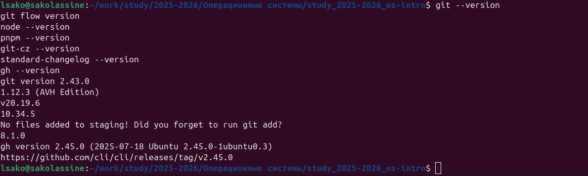{#fig-001 width=95%}

Также была проверена версия Node.js:

node --version

и менеджера пакетов pnpm:

pnpm --version

В рабочем окружении использовались Node.js v20.19.6 и pnpm 10.34.5.

Для генерации стандартизированных сообщений коммитов использовался Commitizen с адаптером cz-conventional-changelog.

Проверка генератора журнала изменений выполнялась командой:

standard-changelog --version

Получен результат:

8.1.0
Настройка Conventional Commits

В проекте была настроена конфигурация Commitizen:

{
  "config": {
    "commitizen": {
      "path": "cz-conventional-changelog"
    }
  }
}

После настройки команда:

git cz

запускает интерактивное создание Conventional Commit.

В качестве типов изменений были доступны:

feat;
fix;
docs;
style;
refactor;
perf;
test;
chore;
revert;
WIP.
Конфигурация Gitflow

Gitflow был инициализирован командой:

git flow init

В качестве основной ветки была выбрана master, а веткой разработки была назначена develop.

Для вспомогательных веток использовались стандартные префиксы:

feature/
bugfix/
release/
hotfix/
support/

Для версий был установлен префикс:

v

После настройки ветка develop была опубликована:

git push --all
git branch --set-upstream-to=origin/develop develop

Структура веток была проверена командой:

git branch

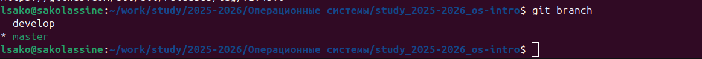{#fig-002 width=95%}

## Создание первого релиза 1.0.0

На основе ветки develop была создана релизная ветка:

git flow release start 1.0.0

Для формирования первого журнала изменений использовалась команда:

standard-changelog --first-release

Созданный CHANGELOG.md был добавлен в индекс и зафиксирован в Git.

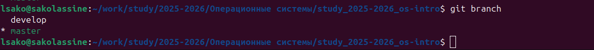{#fig-003 width=95%}

После этого релизная ветка была завершена:

git flow release finish 1.0.0

Изменения были отправлены на GitHub:

git push --all
git push --tags

На GitHub был создан релиз:

gh release create v1.0.0 -F CHANGELOG.md

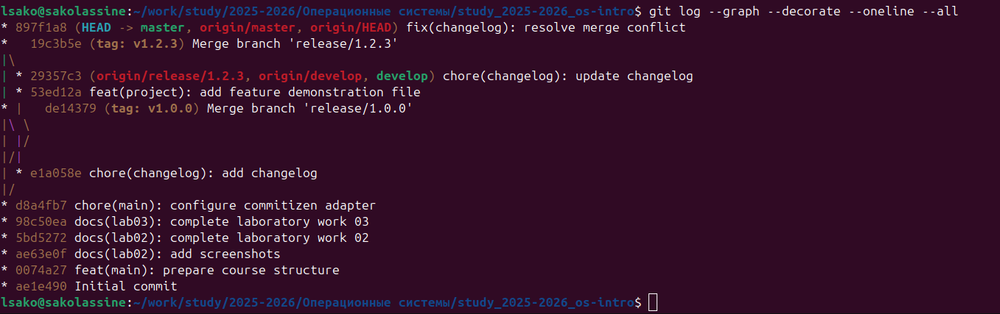{#fig-004 width=95%}

## Проверка версий и тегов

Для просмотра существующих тегов использовалась команда:

git tag

В репозитории был создан тег:

v1.0.0

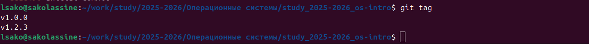{#fig-005 width=95%}

Состояние проекта также проверялось в среде разработки.

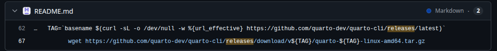{#fig-006 width=95%}

## Разработка новой функциональности

После завершения первого релиза работа продолжилась в ветке develop.

Для разработки новой функциональности была создана ветка:

git flow feature start feature_branch

В ветке был создан демонстрационный файл:

echo "# Feature branch test" > FEATURE.md

Файл был добавлен в индекс:

git add FEATURE.md

Для создания Conventional Commit использовалась команда:

git cz

В интерактивном режиме были выбраны:

type: feat
scope: project
subject: add feature demonstration file

В результате был создан коммит:

feat(project): add feature demonstration file

После завершения работы функциональная ветка была объединена с develop:

git flow feature finish feature_branch

Изменения были отправлены на GitHub:

git push --all
## Создание релиза 1.2.3

Для подготовки следующего релиза была создана ветка:

git flow release start 1.2.3

Номер версии в package.json был изменён на:

"version": "1.2.3"

После изменения версии был сформирован журнал изменений:

standard-changelog

В журнал были включены изменения, в том числе:

feat(project): add feature demonstration file

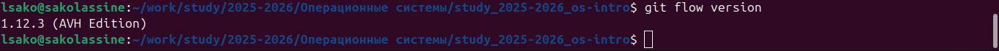{#fig-009 width=95%}

Изменения были добавлены в индекс и зафиксированы:

git add package.json CHANGELOG.md
git commit -S -m "chore(changelog): update changelog"

После подготовки релиза была выполнена команда:

git flow release finish 1.2.3

В процессе завершения релиза возник конфликт в CHANGELOG.md, поскольку файл изменялся одновременно в разных ветках.

Конфликт был разрешён вручную с сохранением информации о релизе и выполненных изменениях.

После разрешения конфликта был создан коммит:

fix(changelog): resolve merge conflict
## Создание тега v1.2.3

После завершения слияния был создан аннотированный тег:

git tag -a v1.2.3 -m "Release version 1.2.3"

Для проверки содержимого тега использовалась команда:

git show v1.2.3

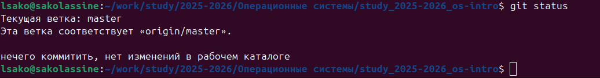{#fig-007 width=95%}

В локальном репозитории присутствуют следующие версии:

v1.0.0
v1.2.3
## Публикация релиза v1.2.3

После создания версии релиз был опубликован на GitHub:

gh release create v1.2.3 -F CHANGELOG.md

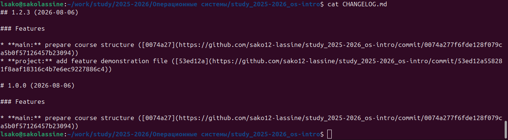{#fig-008 width=95%}

Содержимое журнала изменений было подготовлено для публикации вместе с релизом.

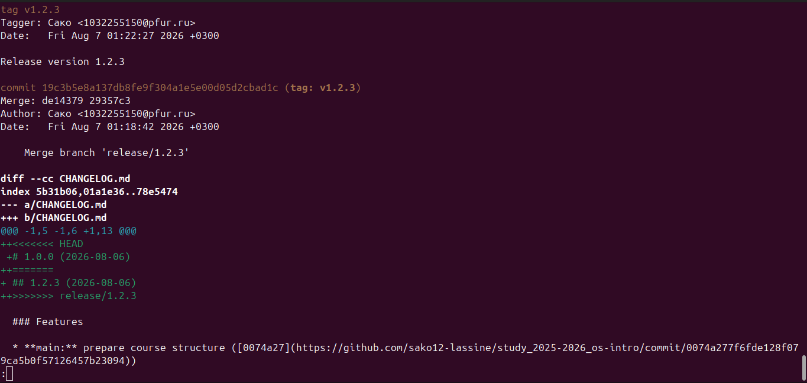{#fig-010 width=95%}

Итоговое состояние репозитория было проверено на GitHub.

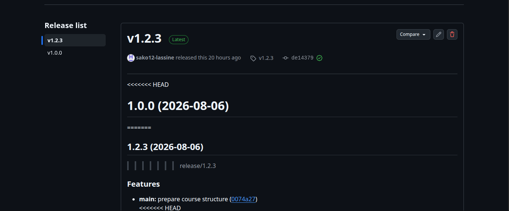{#fig-011 width=95%}

Финальное состояние локального репозитория также было проверено с помощью Git.

git status
git branch
git tag
git log --graph --decorate --oneline --all

Рабочее дерево находилось в чистом состоянии, а основная ветка была синхронизирована с origin/master.

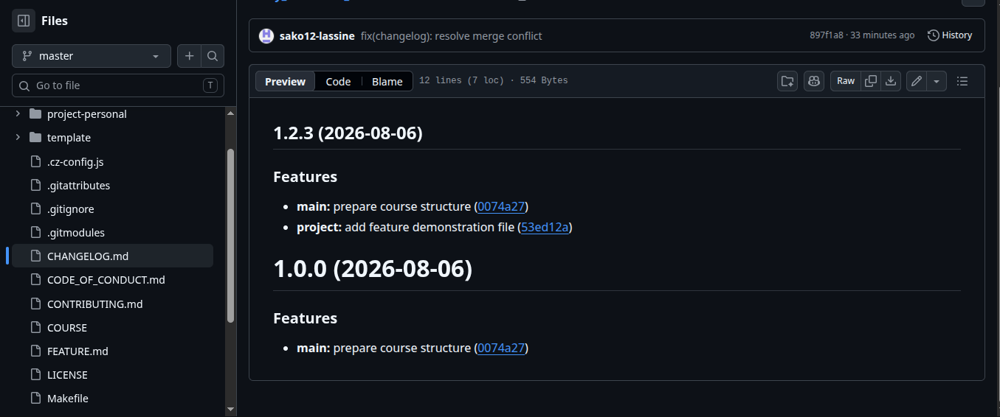{#fig-012 width=95%}

# Выводы

В ходе лабораторной работы были получены навыки правильной работы с репозиториями Git.

Была настроена модель Gitflow с использованием веток master и develop, а также освоена работа с функциональными и релизными ветками.

Были настроены Conventional Commits и Commitizen, что позволило формировать стандартизированные сообщения коммитов.

Было освоено семантическое версионирование и созданы версии v1.0.0 и v1.2.3.

С помощью standard-changelog был сформирован журнал изменений проекта.

Также были опубликованы релизы проекта на GitHub с использованием GitHub CLI.

В результате была получена практическая схема организации разработки, подготовки релизов и публикации версий проекта с использованием Git, Gitflow и GitHub.

Список литературы {.unnumbered}
Git Documentation.
Gitflow Workflow.
Semantic Versioning 2.0.0.
Conventional Commits.
GitHub CLI Documentation.

::: {#refs}
:::
